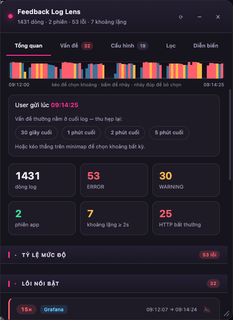
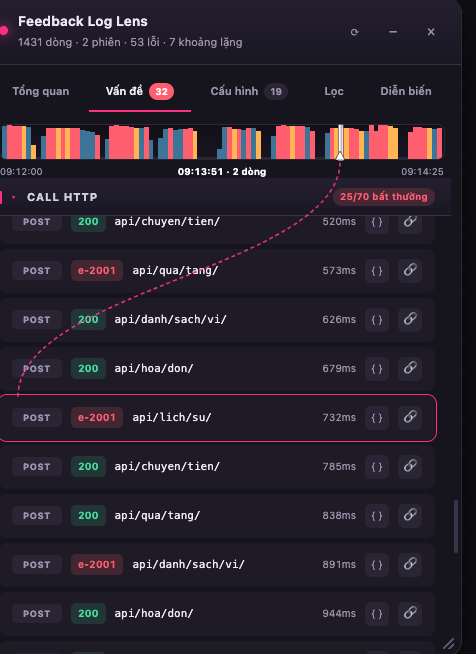
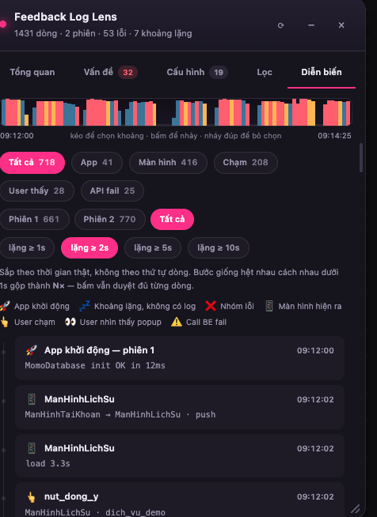
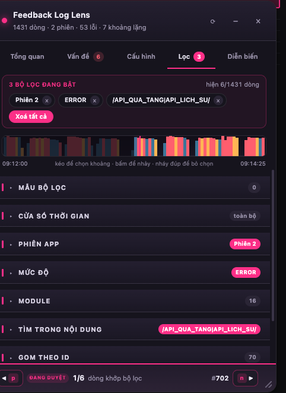
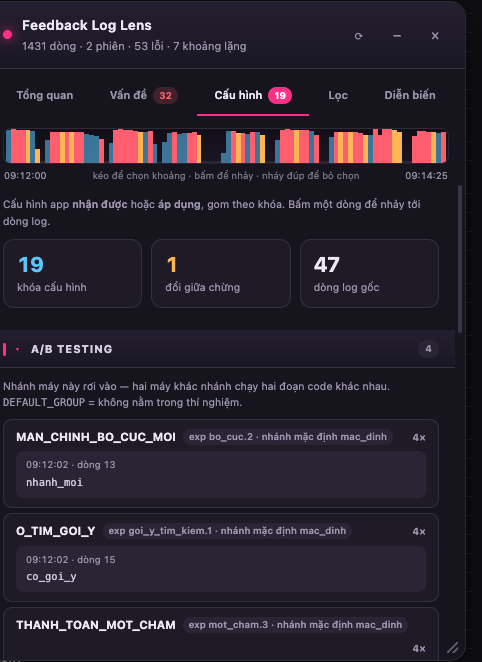

# Feedback Log Lens

Đọc nhanh log feedback trên `adminapp.momocdn.net/utilities/feedback/detail`.
Trang admin chỉ có search theo text; tool này gom nhóm lỗi, thống kê, lọc tại chỗ và dựng timeline.

> Công cụ cá nhân, không phải sản phẩm chính thức của tổ chức nào. Chỉ đọc DOM sẵn có trên trang,
> không gọi API, không gửi dữ liệu đi đâu. Repo này **không** chứa log thật hay dữ liệu người dùng —
> mọi ví dụ trong code và tài liệu đều là dữ liệu bịa.

Đo trên một log thật (4085 dòng, 1.1MB). Mọi con số `4085` trong tài liệu này đều là số đo trên
chính log đó — chúng minh hoạ, **không tự cập nhật** (log thật không nằm trong repo). Số liệu về
bản build thì ngược lại: khối ngay dưới do `build.sh` ghi lại mỗi lần build.

| | Trang admin | Log Lens |
|---|---|---|
| 47 dòng ERROR | đọc từng dòng | **10 nhóm** theo chữ ký |
| 958 dòng WARNING | đọc từng dòng | **252 nhóm**, sắp theo số lần, tắt tiếng được vĩnh viễn |
| 110 dòng HTTP | lẫn trong log | bảng riêng, lọc 8 call bất thường, mở payload JSON |
| 160 con số thời lượng nằm rải rác | không thấy | bảng xếp hạng — **chậm nhất 54s** |
| 52 giá trị `cmdId`/`request_id` lặp ở nhiều dòng | không dùng được | gom thành chuỗi một request |
| 3 phiên app trong cùng file | không thấy | tách ra, lọc theo phiên |
| 93 dòng timestamp lùi | không cảnh báo | báo ngay, và sắp lại theo thời gian thật |
| Vấn đề nằm ở cuối log | cuộn từ dòng 1 | tự lấy nét vào N giây cuối trước lúc gửi feedback |

---

## Nhìn thử

| | |
|---|---|
|  | **Tổng quan.** Mọi mục thu sẵn, badge nói trong đó có gì. Khối trên cùng tự lấy nét vào mấy giây cuối trước lúc user bấm gửi feedback — chỗ vấn đề gần như luôn nằm. |
|  | **Rê chuột lên một hàng bất kỳ → mũi tên chỉ thẳng lên vị trí của nó trên minimap.** Hết phải tự dịch "09:13:51" ra "khoảng giữa log". Hàng đại diện nhiều dòng thì đánh dấu hết — thấy ngay nó rải đều hay dồn một chỗ. |
|  | **Diễn biến.** Biểu tượng nằm thẳng trên đường thời gian — nhìn dọc một cột là quét được cả chuỗi sự kiện. Chip ở trên vừa là chú giải vừa là bộ lọc, chọn được nhiều loại cùng lúc. Có ô tìm trong mốc. Đã sắp theo thời gian thật, không theo thứ tự dòng. |
|  | **Lọc.** Thu hết mục lại mà vẫn biết đang lọc gì: badge chính là trạng thái bộ lọc. Thanh trên đầu và thanh dưới cùng đều đếm theo đúng tập dòng đang hiện. |
|  | **Cấu hình.** Máy đó chạy với nhánh A/B nào, cờ nào bật, BE và webadmin đẩy xuống cái gì. Hai máy cùng bản app khác nhánh thì chạy hai đoạn code khác nhau — thứ hay bị bỏ sót nhất khi tái hiện bug. |

> Ảnh chụp trên một log **bịa** do `test/demo-log.js` sinh ra, không phải log thật của người dùng.

---

<!-- build-stats -->
<!-- Khối này do build.sh ghi lại mỗi lần build. Đừng sửa tay. -->

| | |
|---|---|
| `extension/lens.js` | **248 KB** (253,849 bytes) |
| Nguồn | 5,518 dòng trong 20 file `src/` |
| Dependency lúc chạy | không có |
| Test | 92 phép thử, `node test/run.js` |

<!-- /build-stats -->

## Cài

1. `chrome://extensions` (Brave: `brave://extensions`) → bật **Developer mode**
2. **Load unpacked** → chọn thư mục `extension/`
3. Mở một feedback bất kỳ. Khi bảng log render xong sẽ có pill `◆ Log Lens · N nhóm lỗi` ở góc dưới phải — bấm để mở panel.

> Từng có thêm bản bookmarklet (một dòng `javascript:` dán vào bookmark, không cần cài). **Đã bỏ.**
> Nó buộc mọi chuỗi trong `src/` phải nằm gọn một dòng để bước rút gọn không làm hỏng cú pháp, và
> bản thân nó đã phình tới 198KB — quá dài để nhiều trình duyệt chịu lưu thành bookmark. Gỡ nó đi thì
> `build.sh` chỉ còn một đầu ra, và `src/` không còn bị ràng buộc định dạng nào.

---

## Dùng

| Tab | Trả lời câu hỏi |
|---|---|
| **Tổng quan** | User gặp chuyện gì, lúc nào, ở màn nào? Cái gì tốn thời gian nhất? Log có gì bất thường? |
| **Vấn đề** | Thật sự có mấy loại lỗi khác nhau? Call nào fail, `errorCode` bao nhiêu, call nào không có response? Có sự cố hạ tầng nào đứng sau không? |
| **Cấu hình** | Lúc đó máy này chạy với cấu hình gì — nhánh A/B nào, cờ nào bật, BE và webadmin đẩy xuống cái gì. Tab tự ẩn khi log không có dòng cấu hình nào. |
| **Lọc** | Chỉ hiện dòng của module X / mức ERROR / phiên 2 / khớp regex. |
| **Diễn biến** | Một dòng thời gian: user bấm gì, thấy popup gì, app đứng im lúc nào, lỗi nổ ở đâu. Lọc theo phiên app ngay tại đây. |

Từng có bảy tab. **HTTP** gộp vào **Vấn đề** ("call nào hỏng" và "lỗi gì đã nổ" là cùng một câu hỏi,
trước phải mở hai tab mới ghép lại được), **Chậm** gộp vào **Tổng quan** (ba mục của nó cũng là "số
rút từ log" y như mọi mục khác ở đó). Từ khi mỗi mục tự thu lại được thì một tab nhiều mục không còn
đắt chỗ nữa — mà hai tab cùng trả lời một câu hỏi thì luôn đắt.

**Mọi mục đều thu lại sẵn, và mỗi mục có một badge.** Mở tab ra từng là một bức tường. Nay mỗi tiêu đề
mục là một nút: bấm để mở, bấm lại để thu, trạng thái nhớ qua `localStorage` (`fll.openSections`) theo
từng tab riêng — hai tab có mục trùng tên vẫn là hai mục khác nhau. Mặc định là **thu hết**, trừ khi đi
vào bằng một lối tắt: bấm thẻ "phiên app", nút "Xem tất cả N nhóm lỗi" hay thẻ "HTTP bất thường" thì
mục đích đến tự mở ra, vì cuộn tới một mục đang đóng thì chẳng thấy gì.

Badge là **thứ duy nhất nhìn thấy khi mục đang thu**, nên nó phải tự trả lời "trong này có gì":
`Lỗi nổi bật · 10`, `Call HTTP · 8/58 bất thường`, `Phiên app · 9 phiên`. Ở tab Lọc badge còn là **trạng
thái bộ lọc**, tô accent khi đang bật: `Mức độ · ERROR`, `Tìm trong nội dung · /timeout|retry/`,
`Kết quả · 3/4085`. Nhờ vậy thu hết mục lại mà vẫn biết mình đang lọc những gì, không phải mở từng cái ra dò.

**Rê chuột lên một hàng bất kỳ → mũi tên chỉ thẳng lên vị trí của nó trên minimap.** Hàng nào cũng có
giờ và số dòng, nhưng đó là *con số*: phải tự dịch "10:02:50" ra "khoảng giữa log" mới biết nó nằm đâu
trong cả phiên. Nay một đường đứt nét nối từ hàng lên đúng cột thời gian đó, kèm vạch đánh dấu **mọi**
dòng mà hàng đó đại diện (một nhóm lỗi 22 dòng thì hiện 22 vạch — thấy ngay nó rải đều hay dồn một
chỗ), và dòng nhãn giữa minimap đổi thành giờ của hàng đang rê. Chạy ở mọi tab và cả trong tấm trượt
payload, vì nó vẽ bằng một lớp SVG phủ lên panel chứ không phải chèn thẻ vào từng hàng — tab thêm sau
này tự động có.

**Minimap** dưới thanh tab là mật độ log theo thời gian, đỏ = có ERROR.

| Thao tác trên minimap | Kết quả |
|---|---|
| Bấm | nhảy tới mốc đó |
| Kéo trên vùng tối | chọn một khoảng thời gian bất kỳ |
| Kéo giữa vùng sáng | dời cả khoảng, giữ nguyên độ dài |
| Kéo mép sáng | co giãn một đầu |
| Nháy đúp | bỏ chọn khoảng |
| Bấm `↔ phóng to` | **vẽ lại minimap trong đúng khoảng đang chọn** — nhiều mốc dính vào nhau thì phóng ra là tách được từng cái. Bấm `✕` ở nhãn bên phải để thu về cả log. |

Phóng to chỉ đổi **cái nhìn**, không đổi tập dòng đang hiện — bộ lọc và vùng phóng to là hai thứ
riêng, bỏ lọc rồi vẫn giữ nguyên vùng đang phóng. Mốc nằm ngoài vùng đó thì mũi tên chỉ ép về mép
gần nhất, tức "nó ở phía bên kia".

Chip `30 giây cuối` / `1 phút` /… chỉ là lối tắt cho những khoảng hay dùng — cả hai cùng ghi vào một chỗ.
Trong lúc kéo chỉ vẽ lại hai miếng mờ; bộ lọc thật chỉ áp lúc thả tay, vì mỗi lần áp là một lượt
4085 dòng cộng layout lại bảng log, quá nặng để chạy theo từng nhịp chuột.

### Mọi con số đều theo dữ liệu đang lọc

Chọn 5 phút cuối thì tỷ lệ mức độ, stat card, module ranking, tracker event, nhóm Vấn đề, HTTP, Chậm,
Diễn biến đều tính trên đúng 5 phút đó — kèm tổng của cả file để đối chiếu (`21/47`).
Về cấu trúc: `data` là kết quả parse (một lần, bất biến), `view` là thống kê của tập đang hiện;
tính lại `view` tốn ~2.5ms nên áp mỗi lần đổi lọc thoải mái.

Ba thứ **cố ý không** scope:

- **Chip đếm trong tab Lọc.** Mỗi facet đếm theo *các facet khác*, bỏ qua chính nó. Nếu không thì chọn
  ERROR xong chip WARNING về 0 và không còn đường nới rộng lại — người dùng tự khoá mình.
- **Tổng số dòng, số phiên app, cảnh báo timestamp lùi.** Là tính chất của file.
- **Khoảng lặng.** Chỉ cắt theo *cửa sổ thời gian*, không theo tập dòng: lọc "chỉ ERROR" mà tính lại
  khoảng lặng thì sinh ra những khoảng giả giữa hai lỗi, sai bản chất.
- **Chuỗi theo ID** cũng không scope: xem một request thì phải xem trọn vẹn.

### Những thứ tiết kiệm nhiều thời gian nhất

**Miniapp tải lỗi.** `feature_miniapp_load` có một nhóm `stage` báo hiệu user vừa nhìn thấy màn lỗi
chứ không phải chỉ số đo: `scr_fail_loading_miniapp`, `toast_fail_loading_miniapp`,
`miniapp_web_js_crash`, `pu_waiting_load_bundle`, `pu_version_update`, `pu_recording`. Tên lấy nguyên
văn từ `AppEvent.FeatureMiniAppLoad.Stage` trong source app, không đoán từ log. Chúng vào thẳng mục
*User đã nhìn thấy gì*. Hai log dùng để thử đều **0 lần** — hai log đó không gặp sự cố tải miniapp,
không phải sai tên.

**Màn tải lâu nhất.** Khác hẳn *Ở lâu nhất trên màn*: đây là **số có sẵn trong log** (`duration` của
`auto_screen_displayed` lúc `state=load`, và của `auto_load_progress_tracked`), không phải số tính ra.
Tab Chậm vốn gom mọi `duration=` vào một rổ mà không gắn với màn nào; mục này gắn được, và trên log
production dùng để thử nó lôi ra ngay màn `Feedback` mất **30 268ms**.

**Cấu hình máy đó đang chạy.** Hai máy cùng bản app vẫn có thể chạy hai đoạn code khác nhau, và log
có ghi lại điều đó — chỉ là nằm rải rác ở hơn mười dạng dòng khác nhau, đều ở mức INFO nên không nhóm
lỗi nào đụng tới. Tab **Cấu hình** gom lại theo khóa, chia theo **nguồn đọc được ngay trên dòng đó**:

| Nguồn | Đọc từ đâu | Ví dụ moi được từ log thật |
|---|---|---|
| A/B testing | `ABTestingExpTag(namespace=…, tag=…)`, `ABTest tag for namespace X => Y` | `FULLSCREEN_OPTIMZATION = new_full_screen` |
| BE trả về | `Persist … key=… raw={…}`, `@@DynamicConfig :: responseBody:`, `…ConfigResponseDTO(…)` | `sentry_remote_config = {"enable":true,"handledRate":0.3,…}` |
| Webadmin | dòng có chữ `webadmin`, `AppFeatureUpdater`, `OMEGA FEATURE TESTINGS` | `mustHave:[tabbar_promotion,tabbar_home,…]` |
| CDN | `@@ configs >> fetchConfig >> url:` | `PaymentError.json`, `design_system_7.json` |
| App đã áp dụng | `@@SentryKMP ::`, `ApiSpamDetector: Config:` | `tracesSampleRate=1.0 hasPersistedRemoteConfig=true` |
| Chưa rõ nguồn | dòng tự gọi mình là config, có JSON, nhưng không nói lấy từ đâu | `onGetConfigBanner getConfig {…}` |

Nhãn nguồn **không suy đoán**: khóa nào dòng log không tự khai nguồn thì nằm ở "Chưa rõ nguồn" chứ
không bị gán bừa vào BE.

Một khóa ghi nhiều lần cùng giá trị chỉ chiếm một hàng. Ghi ra giá trị **khác** thì mọi giá trị cùng
hiện, kèm giờ và số dòng để bấm sang so — nhãn ghi đúng thứ đo được (*"N giá trị khác nhau"*) chứ
không phải *"đổi N lần"*: nhiều giá trị đôi khi chỉ vì payload mang theo `cmdId` khác nhau mỗi call.
Trên log production thử nghiệm, `AutopickConfigResponseDTO` ra 6 giá trị đúng vì lý do đó.

**Hai cái bẫy đã chặn sẵn** (đều có test): dòng payload khuyến mãi dài 5000 ký tự có chữ
`displayConfig=` nằm *sau* dấu `{` — không tính là cấu hình, vì chữ "config" phải đứng **trước** khối
JSON thì dòng đó mới thật sự nói về cấu hình. Và động từ `configure`/`configured` (báo xong một bước)
bị loại riêng, còn `configuration` thì vẫn nhận.

Call BE có chữ `config` trên **đường dẫn** (đã bỏ query, nên `?displayConfig=` của API khác không lọt
vào) được kéo riêng thành một mục cuối tab, dùng lại đúng hàng của tab HTTP nên vẫn bấm `{ }` xem
payload được. Nhờ mục này, log production không có dòng cấu hình nội bộ nào vẫn trả lời được câu
"app xin cấu hình gì từ BE".

**Cố ý không ghép cặp `stage`.** Nhìn qua thì `<stage>_start` / `<stage>_status` trông như ghép được
thành cặp để tính "bước nào chưa xong". Nhưng trên log thật, UAT có `miniapp_load_start` ×14 mà không
có `_status` nào cùng tên, còn production thì `miniapp_load_start` ×10 đi cùng `miniapp_render_status`
×10 — tên kết thúc không khớp tên bắt đầu. Ghép theo gốc tên là suy đoán, nên không làm.

**Nhiễu từ chính hệ thống đo lường.** Đo trên **50 feedback production thật** (25 iOS, 25 Android,
lấy qua API danh sách của trang admin): **1267 / 2488 dòng ERROR — 51% — không phải lỗi user gặp**,
mà là lỗi của lớp tracing. **24 / 49 log có quá nửa số dòng ERROR** thuộc loại này.

| chữ ký | dòng (trên 50 log) | nguyên nhân trong app |
|---|---|---|
| `GrafanaTrace.*:: no traceId` | 1099 | `withTraceId()` gọi `buffer.remove()` nên traceId chỉ dùng được một lần |
| `grafana >> DefaultRequestQueue >> handleError` | 138 | hàng đợi gửi trace của chính Grafana lỗi |
| `GrafanaTrace.* PaymentSession is null` | 30 | `resolveFormatter()` trả null khi Koin scope đã đóng |

Chúng ghi bằng `logger.e` trực tiếp nên **không** bị cờ Debug Tool cắt — tức có mặt trên máy user thật,
khác hẳn các dòng `@@ grafana >> startTrace` (chỉ 2/50 log có).

Tab Vấn đề tách chúng thành một khối riêng ở cuối, không trộn vào danh sách chính và không tính vào
chip đếm. Trên log UAT dùng để thử: **40/44 dòng ERROR là nhiễu**, tách xong còn đúng 4 dòng đáng đọc.

Cố ý **không** tự động tắt tiếng: tắt tiếng là quyết định của người đọc, và đôi khi chính lớp đo lường
hỏng lại là manh mối. Bấm một nút là xem lại được.

**Đừng nhầm `available` với `hasGated`.** `available` chỉ nói log có dòng trace nào không — 68% log
production có, vì vài dòng không bị cờ chặn. `hasGated` mới nói có `startTrace`/`traceFail` thật hay
không — chỉ **4%** log production có. Nhìn nhầm `available` là tưởng log nào cũng có dữ liệu trace.

**Mốc phiên app.** Nhận ba chuỗi thay vì một: `MomoDatabase init OK`, `@@ appSync >> syncStartApp`,
`[PERF] SyncAppFeature, start`. Cả ba đều ghi đúng một lần mỗi lần process khởi động, ở mức INFO, và
không bị cờ debug nào chặn (đã đọc source app). Chuỗi đầu có mặt ở **44/50** log production — 6 log
còn lại cần mốc dự phòng, vì file log bị xoay vòng thì dòng khởi động là dòng bị cắt đầu tiên. Thêm
hai mốc kia làm số phiên nhận ra trên log thử tăng từ 1 lên 3.

**Lỗi từ Grafana trace.** Ngoài các nhóm chữ ký dòng log, tab Vấn đề còn đọc `traceFail` của
`[Module: Grafana]`. Những dòng này mang sẵn `flow` + `step` + `errorCode` + `errorMessage` — mô tả
lỗi rõ hơn hầu hết dòng ERROR trong log — nhưng ghi ở mức **INFO** nên phần gom nhóm không đếm chúng.

Chúng được gom theo **`errorMessage`**, không theo `step`. Lý do nằm trong `GrafanaTracker.generateParams`:

```kotlin
if (!isPlatform(appId) && !isComposeApp(appId) && params.isStaticFlow != true) {
    this.flow = this.appId
    this.step = "${params.flow}.${params.step}"
}
```

Với miniapp thì `flow` bị ghi đè bằng `appId` và `step` bị đổi thành `"flow.step"`, nên **một** sự cố
hạ tầng hiện ra thành hàng chục dòng trông khác nhau. Gom theo `errorMessage` thì chúng về một hàng,
kèm số app bị ảnh hưởng — đo trên một log thật: 45 lần cùng lỗi `500 - B07 No version found from
remote` trải khắp **16 miniapp**, gộp lại thành một hàng thay vì 16 dòng rời tưởng là 16 sự cố lẻ.

Khi `errorMessage` rỗng thì gom theo tên bước, **không** gom theo mỗi `errorCode`: trên log thật,
gom theo mã sẽ nhét chung `TransactionResultV3_call_api_V1_REWARDS_PREDICT` với
`TabBarContainer_call_api_RIGVER_APPVERSION_V1_FEATURES` chỉ vì cả hai đều là `code 200`.

Dòng Grafana chỉ được ghi khi máy gửi feedback bật Debug Tool, nên **có log không có dòng nào**. Lúc
đó tab Vấn đề nói thẳng là log này không có, chứ không để trống — để trống thì người đọc tưởng là
không có lỗi. Đã chạy trên cả log UAT lẫn log production; hai môi trường khác nhau ở lượng dữ liệu
chứ không khác định dạng.

**Tương tác của user.** Mọi event `[Module: MoMoTracker]` đều ghi ở mức **INFO**, nên phần gom nhóm lỗi
(chỉ đọc ERROR/WARNING) không bao giờ nhắc tới chúng — kể cả khi log đang nói user vừa bị một popup
đập vào mặt 5 lần. Lens đọc `params: {k=v}` của các event đó, dựng lại thao tác của user, rồi **đặt
từng phần vào tab đã có đúng chủ đề** chứ không mở thêm tab:

| Đọc ra được | Nằm ở |
|---|---|
| Popup / bottom sheet đã hiện lên | **Tổng quan** — thứ đắt nhất, để ngay tab đầu |
| Nút đã bấm (kèm nhãn tiếng Việt user thật sự thấy, lấy từ `component_id`) | **Tổng quan** |
| Call BE fail theo `ops_receive_be` | **HTTP** — một cửa duy nhất cho câu "call nào hỏng" |
| Màn nào user ở lâu nhất | **Chậm** |
| Toàn bộ bước, trộn cùng mốc app | **Diễn biến** |

Tab **Diễn biến** trước đây tên là Timeline và chỉ có 3 loại mốc của *app* (khởi động / khoảng lặng /
nhóm lỗi) — 29 mốc, tab mỏng nhất panel. Bước tương tác của user cũng là "sắp theo timestamp thật rồi
vẽ dòng thời gian", tức cùng một thứ với hai nguồn khác nhau; tách hai tab thì phải nhảy qua nhảy lại
mới ghép được câu *user bấm gì → app đứng im 3s → lỗi gì*. Nay chung một dòng, lọc bằng chip
`App / Màn hình / Chạm / User thấy / API fail`.

Hai chỗ dữ liệu đánh lừa, đã xử lý:

- **Log ghi lặp.** Cùng một event thường xuất hiện 2 dòng. Với call BE thì khử trùng theo `trace_id`
  — chắc chắn, vì đó là ID của chính call đó (đo trên một log thật: 307 dòng `ops_receive_be` nhưng
  chỉ 166 `trace_id`, đúng bằng số dòng `ops_request_be`). Với thao tác thì không có ID nào để dựa,
  nên chỉ gộp các bước **giống hệt nhau và cách nhau dưới 1s** thành `N×`, không xoá dòng nào —
  bấm vào vẫn duyệt đủ. Ngưỡng 1s chọn theo phân bố thật: các cặp trùng chia hai cụm tách bạch,
  một cụm dưới ~1.1s và một cụm từ 70s trở lên (user làm lại thật ở phiên sau). Riêng bước API fail
  thì **không** gộp thêm: mỗi `trace_id` đã là một call riêng, gộp nữa là lệch với chính số đếm được.
- **"Ở lâu nhất trên màn" là số tính ra**, không phải trường có sẵn trong log: nó là khoảng cách tới
  bước màn hình kế tiếp. Các event nổ liên tiếp trong cùng một lần chuyển màn sẽ ra ~0ms. Trường
  `dwell_time` có sẵn của `roothome_*` để riêng trong phần mô tả, không trộn vào.

**Lấy nét theo feedback.** Khối đầu tab Tổng quan đọc metadata ngay trên trang (`Feature`, `ScreenID`,
`Entry Point`, thiết bị) và cho chip `30 giây cuối` / `1 phút` / `2 phút` / `5 phút`.
Log được chụp đúng lúc user bấm gửi, nên mép phải trục thời gian chính là lúc xảy ra vấn đề —
không phải cuộn từ dòng 1 nữa. Có sẵn nút lọc theo đúng feature của feedback.

**Tắt tiếng chữ ký (🔇 trên mỗi nhóm).** Tắt một chữ ký nhiễu (`SomeModule >> handleError`) một lần,
lưu vào `localStorage`,
mọi feedback mở sau này đều sạch. Badge tab Vấn đề và tab Diễn biến đều bỏ qua nhóm đã tắt.
Bấm chip `🔇 Đã tắt tiếng (N)` để xem lại và bật lại.

**Gom theo ID (🔗).** Một `cmdId` xuất hiện ở 5 dòng là một request đi qua 5 lớp.
Bấm 🔗 ở hàng HTTP, hoặc mục *Gom theo ID* trong tab Lọc, để xem trọn chuỗi rồi `n`/`p` duyệt tại chỗ.

**Payload (`{ }`).** Một request HTTP nằm ở hai dòng log khác nhau và mỗi dòng mang trường khác nhau
(`--encrypted` / `--body` / `--header` / `--exception` ở dòng request, `--status` ở dòng response),
nên `{ }` mở **một tấm trượt có hai tab Request / Response**, badge ghi kích thước nguyên văn của payload.
Mỗi trường là một khối riêng, có tô màu cú pháp, nút copy riêng, và chip **↩ Xuống dòng** (mặc định bật,
nhớ trong `localStorage`) để khỏi cuộn ngang khi gặp chuỗi chữ ký dài mấy nghìn ký tự.

Ba thứ hay làm `JSON.parse` chết đã xử lý sẵn (đo trên log 4085 dòng: 919 khối, 900 khối ra được cấu trúc):

- **Chỗ bị che `****`** — 118 khối. Log che theo hai kiểu: `"****"` trơ trọi giữa object, và `****`
  trần không có nháy; có chỗ che luôn cả *tên* trường (`,****{"displayName":...}`). Quét có phân biệt
  trong/ngoài chuỗi rồi chỉ dọn đúng chỗ bị che, nên `"accountNo":"**** **** **32"` không bị đụng.
  Khối nào phải dọn thì gắn nhãn *đã bỏ \*\*\*\* để parse* — không im lặng sửa dữ liệu.
- **`Map.toString()` của Kotlin/Java** (`{stage=sync_step, location={lat=0.0}}`) — 585 khối,
  chiếm đa số. Không phải JSON, trước đây hiện nguyên văn kèm cảnh báo sai ("do bị che ****").
  Nay đọc thành cây, gắn nhãn *map k=v*. Giá trị giữ nguyên dạng chuỗi vì bản thân log không có kiểu.
- **Payload bị chính logger cắt** — 19 khối. Logger của app cắt message dài
  (`... Log message truncated; exceeds 10000 characters.`) nên khối JSON không bao giờ đóng lại.
  Tool tìm **điểm cắt an toàn gần nhất** — ngay sau một giá trị hoàn chỉnh, sau dấu mở ngoặc, hoặc
  ngay trước dấu phẩy — rồi tự đóng nốt các ngoặc còn mở. 17/17 khối trong log mẫu đọc được,
  16 khối giữ được 98–100% nội dung. Nhãn ghi rõ mất bao nhiêu ký tự cuối.

  Hai chỗ dễ làm sai, đã xử lý:

  - **Số bị cắt không được nhận là giá trị.** `1788464400000` cắt còn `1788` vẫn parse được nhưng là
    số SAI. Thà bỏ hẳn còn hơn đưa ra một con số bịa.
  - **Cắt giữa một chuỗi** (`"payload":"[{\"id\":…`) thì đóng chuỗi lại và thêm `…` vào cuối giá trị
    đó, thay vì vứt cả trường. Không có bước này thì có khối chỉ đọc được 1% nội dung.

**Ô tìm trong tab HTTP.** Tìm theo URL / method / status, **và cả nội dung payload** — phần lớn lúc cần
là dò theo một `cmdId` hay `request_id` nhìn thấy ở dòng khác mà giá trị đó chỉ nằm trong body.
Gõ có debounce 120ms, dòng đầu danh sách ghi *khớp X/Y request*.

### Thanh bộ lọc thường trú

Bộ lọc là state chung nhưng nó cắt bảng log của **trang**, không cắt nội dung các tab.
Nếu chỉ nhìn thấy được ở tab Lọc thì đổi sang tab khác là mất hết dấu hiệu, rất dễ đọc nhầm dữ liệu
mà không biết. Vì vậy khi có bất kỳ điều kiện nào đang bật, một thanh hiện **ở mọi tab**:

```
2 BỘ LỌC ĐANG BẬT              hiện 21/4085 dòng
[2 phút cuối ×] [ERROR ×] [Xoá tất cả]
```

Mỗi điều kiện gỡ riêng được, tab Lọc mang badge số điều kiện, và pill lúc thu nhỏ cũng ghi `· 2 bộ lọc`.

Khi bạn nhảy tới một dòng bị bộ lọc loại (bấm một call HTTP chẳng hạn), dòng đó được hiện ra
và thanh nói thẳng: `hiện 22/4085 dòng · 1 dòng ngoài lọc` — thay vì im lặng làm sai con số.

### Mẫu bộ lọc

Đầu tab Lọc có mục **Mẫu bộ lọc**: đặt điều kiện xong, gõ tên (hoặc để trống lấy tên gợi ý từ chính
các điều kiện đang bật) rồi bấm **Lưu mẫu**. Lần sau bấm một phát là áp lại. Lưu trong `localStorage`
nên còn qua mọi feedback và mọi phiên; bấm `×` trên chip để xoá. Rê chuột lên chip thấy mô tả điều kiện.

Mẫu và permalink dùng **chung một bộ tuần tự hoá** (`serializeFilter` / `applyFilterPayload`),
khác nhau hai chỗ:

- Mẫu **không** mang theo tab đang xem và dòng đang đứng — hai thứ đó vô nghĩa ở feedback khác.
- Khoảng thời gian kết thúc đúng ở `lastTs` được lưu dạng **`wLast: 120000`** ("2 phút cuối") chứ không
  phải mốc tuyệt đối. Nhờ vậy mẫu *"lỗi 2 phút cuối"* dùng lại được ở bất kỳ feedback nào.
  Khoảng brush tuỳ ý thì đành lưu offset so với `firstTs` và kẹp lại theo độ dài log hiện tại.

**Copy link** trong tab Lọc nhét bộ lọc + dòng đang đứng vào URL hash; gửi cho đồng nghiệp là họ
mở ra đúng chỗ đó. Hash chỉ được đọc lúc khởi động và không bao giờ ghi đè `location`,
tránh làm router của SPA chạy lại.

**Phím tắt**

| Phím | Việc |
|---|---|
| `n` / `p` | dòng khớp kế tiếp / trước đó |
| `Esc` | thu panel về pill — **không** mất, bấm pill là mở lại |
| `Alt` + `L` | mở lại sau khi đã bấm `×` đóng hẳn (khỏi reload trang) |

Bấm một nhóm lỗi sẽ đặt nhóm đó làm danh sách duyệt, rồi `n`/`p` đi qua từng lần xuất hiện.

**Kích thước & vị trí:** kéo header để di chuyển; kéo **tay nắm góc dưới phải** để đổi cả rộng lẫn cao;
kéo mép trái nếu chỉ muốn đổi bề rộng mà giữ nguyên mép phải.
Kích thước được nhớ lại khi thu về pill rồi mở ra, và khi đóng rồi mở lại bằng `Alt+L`.

Đổi tab log (Log 1 → Log 2) thì panel tự quét lại sau ~2s, hoặc bấm `⟳`.

---

## Cạm bẫy đọc log mà tool cảnh báo sẵn

Logger của app flush theo lô (`-------- LOGGER: END OF BATCH --------`). Vì vậy **thứ tự dòng không phải thứ tự thời gian**:
trong log mẫu có 93 dòng mang timestamp nhỏ hơn dòng ngay trước nó.
Minimap, gap và tab Diễn biến đều sort lại theo timestamp thật; tab Vấn đề và Lọc thì giữ thứ tự dòng gốc để còn khớp với những gì trang hiển thị.

---

## Sửa repo này

```sh
./build.sh
```

Nối `src/*.js` thành một IIFE rồi ghi `extension/lens.js`, kiểm cú pháp, kiểm kiểu (`tsc --noEmit`),
chạy `node test/run.js`, rồi tự ghi số liệu thật vào khối `<!-- build-stats -->` ở trên.

Kiến trúc, ràng buộc bất biến, các phép đo hiệu năng và những quy tắc giao diện đừng-vô-tình-phá
nằm ở **[CLAUDE.md](CLAUDE.md)** — đọc file đó trước khi sửa.
